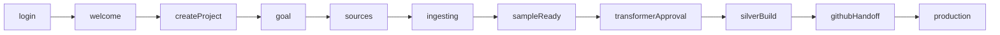

# Walt DE — First-run Click-Through Prototype

## Goal

A standalone, interactive HTML prototype (`/onboarding.html`) that walks through a data engineer's first session with Walt: log in, create a project, scope the platform, connect sources, watch the **Ingestor** sample data, approve the **Transformer**, ride the silver layer build with builder/reviewer agent pairs, hand off to GitHub, and land in production with all 5 agents (Ingestor / Transformer / Reasoner / Operator / Governer) running. Light mode, desktop chrome, real state transitions.

## How it slots in

- Add a **second Vite entry** alongside the existing design-canvas at `index.html`. Same `tokens.css`, same primitives in [src/lib/components.jsx](src/lib/components.jsx) and `WaltWin` chrome pattern in [src/App.jsx](src/App.jsx).
- Visit `http://localhost:5173/onboarding.html` to run the prototype.

## File structure

```
onboarding.html                         (new entry)
vite.config.js                          (declare both entries)
src/onboarding-app/
  main.jsx                              (mounts <OnboardingApp/>)
  App.jsx                               (desktop chrome + state machine)
  state.jsx                             (PhaseProvider — reducer + context)
  agents.js                             (5 primary + sub-agent registry)
  components/
    AgentCard.jsx                       (avatar, status, recent runs)
    AgentBadge.jsx                      (inline agent identity chip)
    WorkspaceTree.jsx                   (local folder structure preview)
    ReviewChecklist.jsx                 (the 7-point reviewer checklist)
    AgentRunLog.jsx                     (live tail of agent activity)
    PhaseStepper.jsx                    (compressed top progress + dev jump)
  steps/
    01-login.jsx
    02-welcome.jsx                      (empty platforms / + New platform)
    03-create-project.jsx               (name, local path, structure preview)
    04-goal.jsx                         (chat: domain, questions, warehouse)
    05-sources.jsx                      (source grid + credentials drawer)
    06-ingesting.jsx                    (Ingestor live · sample window)
    07-sample-ready.jsx                 (preview tables → schedule full)
    08-transformer-approval.jsx         (summon Transformer · approve)
    09-silver-build.jsx                 (S1 dedup → S2 cast → S3 standardise; builder/reviewer pairs, code, checklist)
    10-github-handoff.jsx               (repo created · PR opened · CI green)
    11-production.jsx                   (5 agents running · monitor dashboard)
```

## Phase state machine

A single reducer in `state.jsx` carries the journey forward. Each step calls `advance()` (or `back()`) on its CTA. A small `PhaseStepper` in the chrome lets you jump between phases for design review without restarting.




Shared context fields the reducer tracks: `email`, `projectName`, `localPath`, `domain`, `sampleQuestions[]`, `sources[]`, `warehouseTarget`, `ingestedTables`, `silverStage` (`s1|s2|s3|done`), `repoUrl`.

## Visuals & reuse

- **Desktop chrome**: traffic-light header reused from `WaltWin` in [src/App.jsx](src/App.jsx#L22), pinned light mode + comfortable density.
- **Chat phases (goal, transformer approval)**: reuse `ChatComposer`, `WaltStack`, `BotLine`, `UserBubble`, `PillRow` patterns from [src/screens/onboarding.jsx](src/screens/onboarding.jsx). The composer's clean visual treatment we just landed.
- **Side panel / artifacts**: reuse the disclosure pattern with our new `sidePanel` icon for show/hide.
- **Agents** — each gets identity:
  - **Ingestor** — `download` icon, accent blue
  - **Transformer** — `wand`/`bolt` icon, semantic purple
  - **Reasoner** — `schema`/`sparkle` icon, gold
  - **Operator** — `pulse`/`clock` icon, status-info
  - **Governer** — `shield` icon, status-warn
- **Sub-agent pairs** (builder + reviewer) shown side-by-side in phase 9. Reviewer card surfaces the 7-point checklist with pass/fail/pending dots and the max-round-trip counter.

## Per-step detail (what's on screen)

1. **Login** — centred card on app gray. Email/password + "Continue with Google/Okta". `advance()` on submit.
2. **Welcome** — empty state: "No platforms yet" + `+ New platform`. Sidebar nav rail visible (locked to Sessions).
3. **Create project** — form: project name, local folder picker (mock), warehouse target dropdown. Right side previews the **WorkspaceTree** (medallion structure: `bronze/`, `silver/{s1,s2,s3}/`, `gold/{dims,facts,agg}/`, `platinum/`, `semantic/`, `tests/`, `policies/`).
4. **Goal (chat)** — Walt asks four things in sequence: domain (Finance / Product / Growth / Ops), three day-one questions (pill row), staging warehouse name, env stage. Each answer renders in the transcript.
5. **Sources** — grid of source types (CSV/Parquet, Kafka, NetSuite, SQL Server, Postgres, Airflow connector). Click one → side drawer for credentials (Walt picker or upload). Multi-select supported.
6. **Ingesting (sample)** — `Ingestor` agent live. Big progress card: "Pulling sample · last 30 days · 220 tables". Right rail: `AgentRunLog` tailing. Hint: "This usually takes hours; we're starting with a sample so you can see what's there." CTA disabled until sample completes (fake-progresses on a timer or on click).
7. **Sample ready** — table preview of 4–5 ingested entities with row counts, schema, _ingested_at column. Two CTAs: "Schedule full ingestion in background" (toggle) + "Bring in Transformer →".
8. **Transformer approval** — chat phase. Walt summons Transformer (banner with agent identity). "Want me to start silver, or add more sources?" Approve → next.
9. **Silver build** — central stage with three substep cards (S1 dedup, S2 type-cast, S3 standardise). Each card shows builder agent + reviewer agent, code preview (SQL DDL snippet using `hilite()`), `ReviewChecklist` with 7 checks, round-trip counter (n/3), test results row-count parity. Approve gate per substep. After S3, "Open PR" CTA.
10. **GitHub handoff** — split: left a fake GitHub PR view (commits, files changed, CI green), right Walt explaining the prod path (staging/dev → main → prod agents). CTA "Promote to production".
11. **Production** — five `AgentCard`s laid out, each with current status, last run, next run, recent activity. Operator card flags one schema drift; Governer card shows a policy enforcement event. Walt at the top: "Your platform is live. I'll keep things running."

## Vite multi-page config

Update [vite.config.js](vite.config.js):

```js
import { defineConfig } from 'vite'
import react from '@vitejs/plugin-react'

export default defineConfig({
  plugins: [react()],
  build: {
    rollupOptions: {
      input: {
        main: 'index.html',
        onboarding: 'onboarding.html',
      },
    },
  },
})
```

In dev both are served — visit `/` for the design canvas, `/onboarding.html` for the prototype.

## What's intentionally out of scope (for v1 of this scenario)

- Real persistence (state resets on reload — this is a click-through).
- Reasoner / Operator / Governer don't get their own dedicated walkthrough phases — they're introduced in Phase 11 as live agents on the production dashboard. We can add their own deep-dive phases in a follow-up.
- Production agent monitoring is one screen, not a full ops dashboard.
- All numbers, table names, and progress are mocked.

